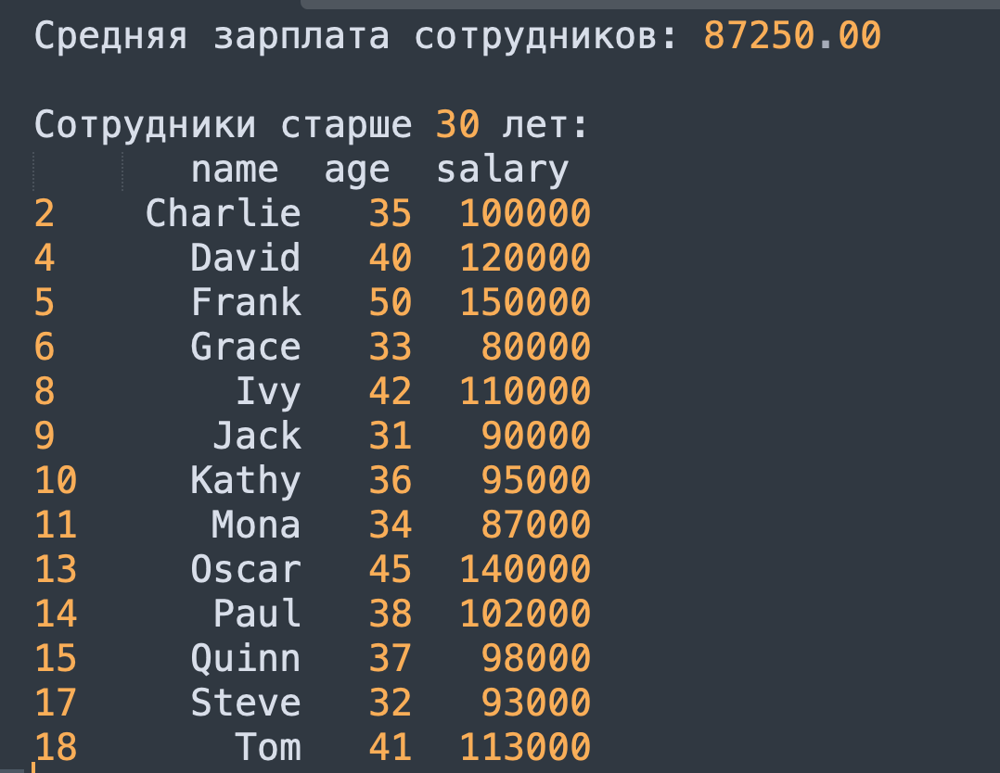
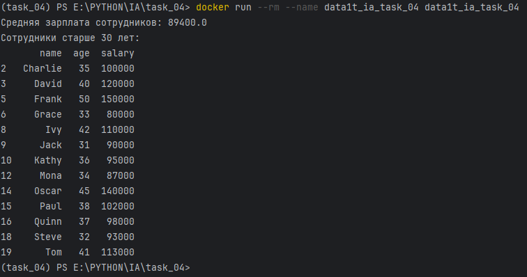

# Итоговая аттестация Задание 4.


## Создание Docker-контейнера с Pandas

## Цель:
Научиться создавать Docker-контейнер с Python-приложением, которое выполняет анализ данных с использованием библиотеки Pandas. В этом приложении будет произведен расчет средней зарплаты и выборка сотрудников старше 30 лет.

## Описание задания:

- Создайте директорию для проекта и необходимые файлы.
- Создайте файл data.csv с примерными данными о сотрудниках. Убедитесь, что в файле не менее 20 строк.
- Пример содержимого data.csv:
<details>
  <summary>data.csv</summary>
<table>
  <tr>
    <th>name</th>
    <th>age</th>
    <th>salary</th>
  </tr>
  <tr>
    <td>Alice</td>
    <td>30</td>
    <td>70000</td>
  </tr>
  <tr>
    <td>Bob</td>
    <td>25</td>
    <td>50000</td>
  </tr>
  <tr>
    <td>Charlie</td>
    <td>35</td>
    <td>100000</td>
  </tr>
  <tr>
    <td>David</td>
    <td>40</td>
    <td>120000</td>
  </tr>
  <tr>
    <td>Eve</td>
    <td>28</td>
    <td>60000</td>
  </tr>
  <tr>
    <td>Frank</td>
    <td>50</td>
    <td>150000</td>
  </tr>
  <tr>
    <td>Grace</td>
    <td>33</td>
    <td>80000</td>
  </tr>
  <tr>
    <td>Hank</td>
    <td>29</td>
    <td>55000</td>
  </tr>
  <tr>
    <td>Ivy</td>
    <td>42</td>
    <td>110000</td>
  </tr>
  <tr>
    <td>Jack</td>
    <td>31</td>
    <td>90000</td>
  </tr>
  <tr>
    <td>Kathy</td>
    <td>36</td>
    <td>95000</td>
  </tr>
  <tr>
    <td>Leo</td>
    <td>24</td>
    <td>48000</td>
  </tr>
  <tr>
    <td>Mona</td>
    <td>34</td>
    <td>87000</td>
  </tr>
  <tr>
    <td>Nina</td>
    <td>26</td>
    <td>65000</td>
  </tr>
  <tr>
    <td>Oscar</td>
    <td>45</td>
    <td>140000</td>
  </tr>
  <tr>
    <td>Paul</td>
    <td>38</td>
    <td>102000</td>
  </tr>
  <tr>
    <td>Quinn</td>
    <td>37</td>
    <td>98000</td>
  </tr>
  <tr>
    <td>Rachel</td>
    <td>27</td>
    <td>62000</td>
  </tr>
  <tr>
    <td>Steve</td>
    <td>32</td>
    <td>93000</td>
  </tr>
  <tr>
    <td>Tom</td>
    <td>41</td>
    <td>113000</td>
  </tr>
</table>
</details>

- В файле app.py создайте Python-скрипт, который будет:
  - Загружать данные из data.csv.
  - Вычислять среднюю зарплату всех сотрудников.
  - Отбирать и выводить только тех сотрудников, которым больше 30 лет.

- Создайте Dockerfile для сборки образа вашего Python-приложения, использующего Pandas.
- После запуска контейнера вы должны увидеть в терминале вывод с:
  - Средней зарплатой всех сотрудников.
  - Списком сотрудников, которым больше 30 лет.

## Пример вывода:


## Результат задания
 После выполнения задания у вас будет Docker-образ, который при запуске выполняет анализ данных с использованием Pandas. Скрипт выводит среднюю зарплату сотрудников и список сотрудников старше 30 лет. 

## Вывод
- Установка и запуск
```docker run --rm --name data1t_ia_task_04 alneoru/data1t_ia:task_04```

